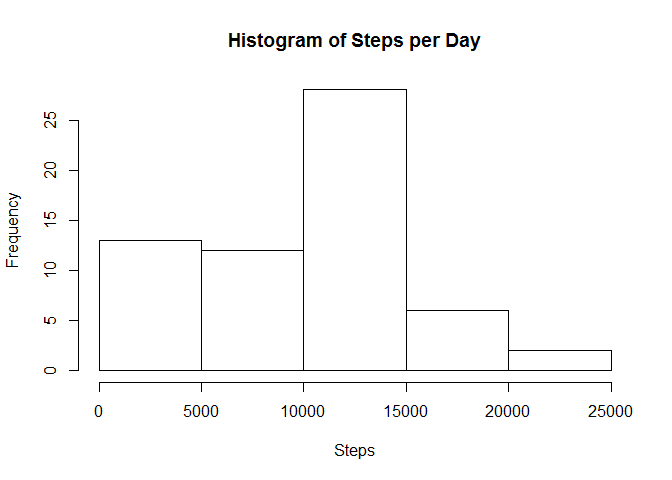
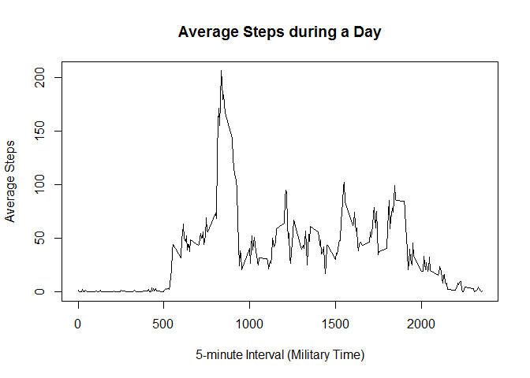
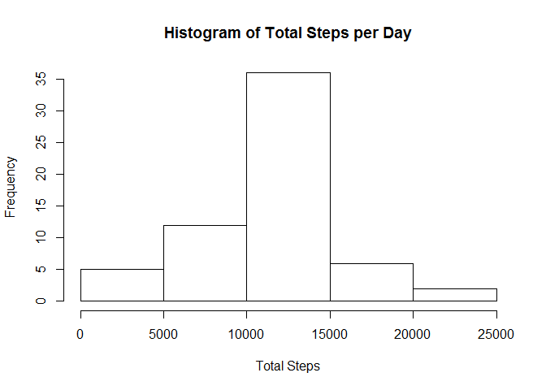
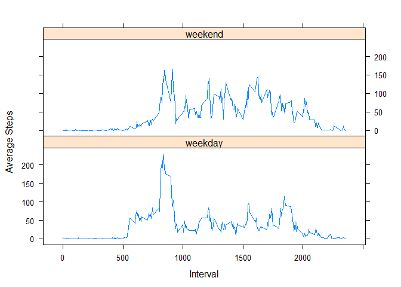

# Reproducible Research: Peer Assessment 1


## Loading and preprocessing the data

```r
activity <- read.csv("./activity/activity.csv", colClasses= c("numeric", "Date", "numeric"))
```


## What is mean total number of steps taken per day?
###Total Steps by Day

```r
daily_steps <- aggregate(activity$steps, by = list(Group.Date = 
                        activity$date ), FUN = sum, na.rm = TRUE)
 hist(daily_steps$x, main ='Histogram of Steps per Day', xlab = "Steps")
```

 

```r
test <- summary(daily_steps$x)
param <- c(test[3], test[4])
 print(param)
```

```
## Median   Mean 
##  10400   9354
```

## What is the average daily activity pattern?

```r
Interval_steps <- aggregate(activity$steps, by = list(Group.Interval = activity$interval), FUN = mean, na.rm = TRUE)

plot(Interval_steps$Group.Interval,Interval_steps$x,
      main = "Average Steps during a Day",
      xlab = "5-minute Interval (Military Time)",
      ylab = "Average Steps",
     type = "l")
```

 

```r
maxStepInterval <- Interval_steps[Interval_steps$x== max(Interval_steps$x),]
print(paste(" 5-min Interval with average most steps:", maxStepInterval[1]))
```

```
## [1] " 5-min Interval with average most steps: 835"
```

## Imputing missing values

```r
sum(!complete.cases(activity))
```

```
## [1] 2304
```

```r
Newactivity <- activity
missing <- is.na(Newactivity)
# The strategy was to replace the "NA"s with mean values
Newactivity[missing] <- tapply(Newactivity$steps, Newactivity$interval,
                                      mean, na.rm = TRUE)
PatchDaily_steps <- tapply(Newactivity$steps, Newactivity$date, sum)
hist( PatchDaily_steps, main = "Histogram of Total Steps per Day",
      xlab = "Total Steps")
```

 

```r
sum2 <- summary(PatchDaily_steps)
param2 <- c(sum2[3],sum2[4])
print(param2)
```

```
## Median   Mean 
##  10770  10770
```
The new estimates differ a bit from the previous ones. The imputed values pushed both median and mean higher.


## Are there differences in activity patterns between weekdays and weekends?
###Yes, activities start earlier during week days.

```r
weekpart <- function(date) {
    if (weekdays(date) %in% c("Saturday", "Sunday")) {
        "weekend"
    } else {
        "weekday"
    }
}
Newactivity$Weekpart <- as.factor(sapply(Newactivity$date, weekpart))

GroupNewactivity <- aggregate( Newactivity$steps, 
                      by = list(Interval = Newactivity$interval,
                        weekpt = Newactivity$Weekpart), mean)
library(lattice)
```

```
## Warning: package 'lattice' was built under R version 3.1.3
```

```r
xyplot(GroupNewactivity$x~GroupNewactivity$Interval | 
            GroupNewactivity$weekpt, type = "l", layout = c(1, 2),
        xlab = "Interval", ylab = "Average Steps")
```

 
